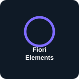

# Hi 👋, I'm **Gowtham V**

### A passionate SAP ABAP Developer & Tech Enthusiast.

---

## SAP & ABAP Development

<table>
<tr>
<td align="center"> <b>SAP</b></td>
<td align="center"> <b>ABAP</b></td>
<td align="center"> <b>CDS</b></td>
<td align="center"> <b>RAP</b></td>
<td align="center"> <b>OData</b></td>
<td align="center"> <b>Fiori Elements</b></td>
<td align="center"> <b>S/4HANA</b></td>
<td align="center"> <b>SAP HANA</b></td>
</tr>
</table>

## Additional Skills

<table>
<tr>
<td align="center"> <b>C</b></td>
<td align="center"> <b>Embedded C</b></td>
<td align="center"> <b>Figma</b></td>
</tr>
</table>

## Tools & Version Control

<table>
<tr>
<td align="center"> <b>Git</b></td>
<td align="center"> <b>GitHub</b></td>
</tr>
</table>

## Completed Project

### SAP ABAP Employee Management System

**Employee Data Management Application**

[github.com/gowtham-vangapandu/sap-project ↗](https://github.com/gowtham-vangapandu/sap-project)

---

